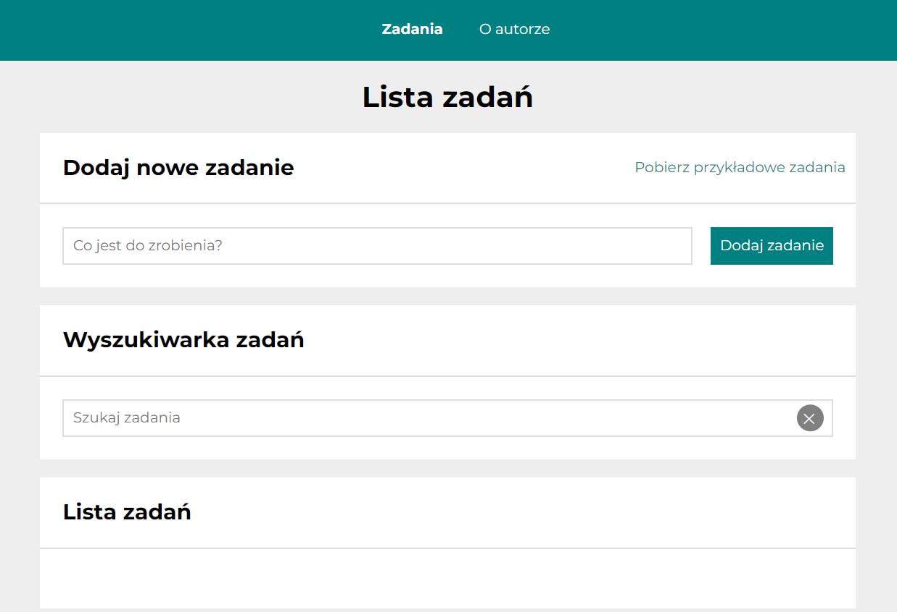
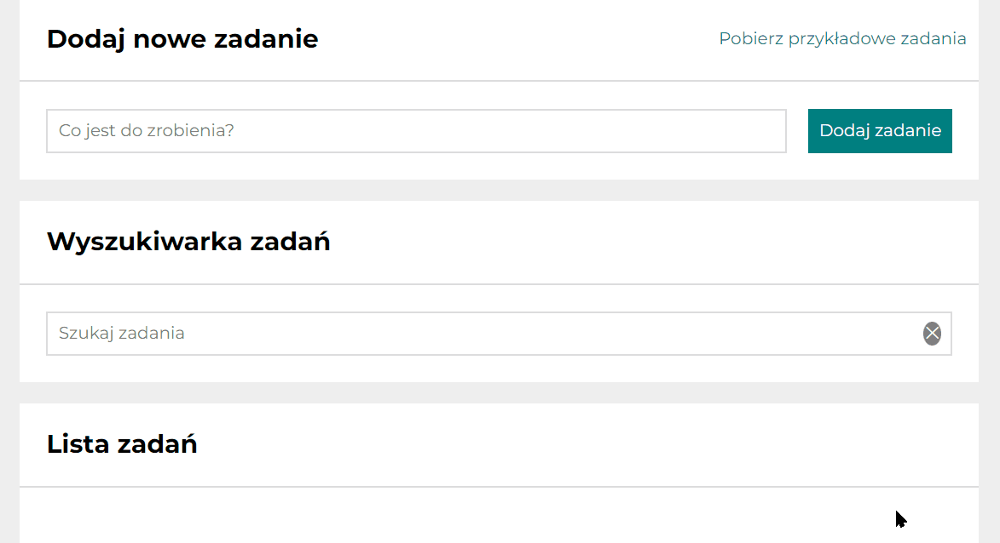
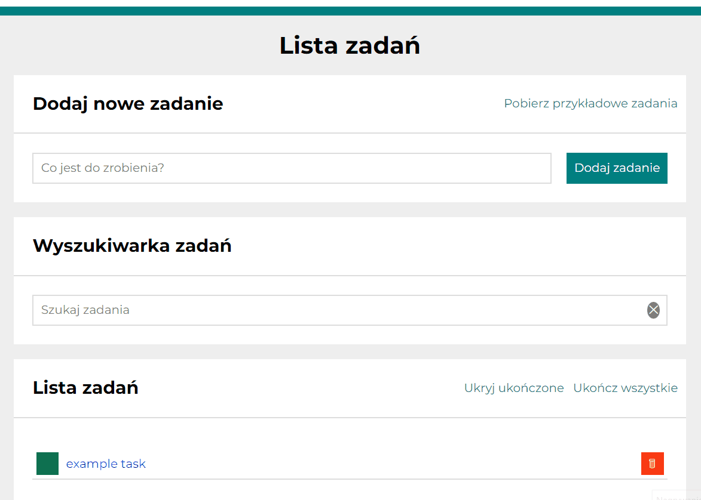
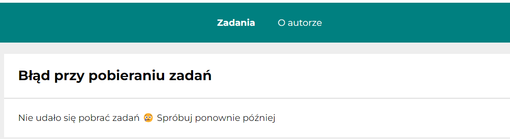
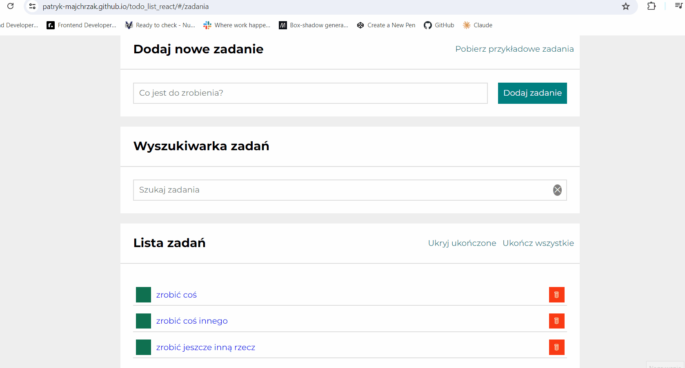
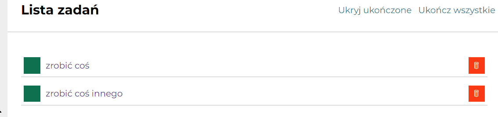
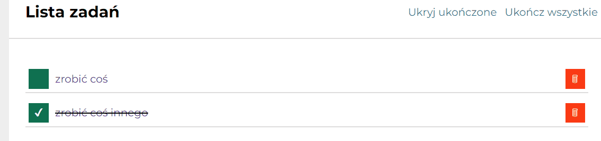
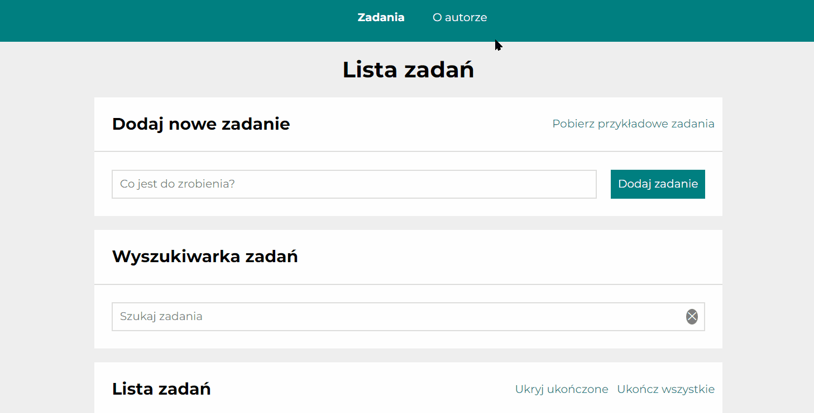

# To-do List with react

This project was bootstrapped with [Create React App](https://github.com/facebook/create-react-app).

## Description
Hi! Welcome to my todo list, where you can create your list of tasks that can help you organize your work. 😊 Below som information for users how to navigate through the website and information for developers about code itself. So, what are you waiting for? Click th link in the demo and try it out 😉

## Details for users
1. Website is available only in polish (I am about to add language selection in thee future, so it will be available in english as well)
2. After starting the website you should see navigation with two subpages. Subpage "zadania" (tasks) should be selected and there should be three sections:
- Dodaj nowe zadanie (Add new task) with place where you can wirte task you can add and button for adding it
- Wyszukiwarka (Search section) which allows you to filter tasks by key words you can put in the input
- Lista zadań (Tasks list) which will display tasks you added or if you filtered some in "Wyszukiwarka" section only tasks with key words will be displayed. If you enter the website for the first time, tasks list will be empty, however it will save tasks on your device and generate yor tasks list  

3. You can add new task to your to-do list by selecting the input with "Co jest do zrobienia?" (What needs to be done) text and click button with "Dodaj zadanie" (add task). Task will go to section called "lista zadań" (tasks list)

4. You can also click on "Pobierz przykładowe zadania" (download example tasks) button to geenerate 2 example tasks in tasks list. You have to confirm that you want to proceed. Warning: example tasks will replace tasks that are already in tasks list. If you decide to proceed button wil be disabed for 1 second and will change its text to "Ładuję zadania" (loading tasks). After loading tasks "zrobuć coś" (do something) and crossed out "zrobić coś innego" (do something else) should appear. 

If there will be any potential error during downloading example tasks, below message will be displayed

5. You can filter tasks in "Wyszukiwarka" by selecting input "Szukaj zadania" (search for task). Task will filter tasks and return only ones which have key words put in search input. Anything you search will be added to the URL, so it will be easy to for you to come back to tasks you were filtering (you can paste changed URL like in animation below). If you click on "X" sign in the search input all tasks will be displayed again 

6. You can select existing tasks by
- clicking green button which changes tasks status from not done to done and from done to not done. Done tasks are crossed out and have "✔" icon inside of the button

 

- clicking red button which removes task entirely

7. You can mark all tasks as done by clicking "ukończ wszystkie" (finish all) you can mark all tasks as done

8. You also can hide all tasks that are done by clicking "Ukryj ukończone" (hide done) which hides all done tasks and chcnges text into "pokaż ukończone" (show done). If you click on the text once again all done tasks will show up again

9. You can click on specific task to see its title and if it is done or not (options Ukończono: tak and Ukońcozno: nie means done: yes and done: no). You can then go back by clicking the arrow near the task title.

10. You can click "O autorze" (about author) to see quick note about me with a photo

## Details for developers

1. For styling website I used styled-components NPM library
2. Whole application has been put into ThemeProvider and themes for various colors and breakpoints for max-width have been added 
3. App has alternative box model in GlobalStyle
4. I used media queries to change how website will be displayed on various devices
5. App downloads data from localStorage using axios library
6. Hooks used:

React:
- useState
- useRef

React-redux:
- useSelector
- useDispatch

React-router:
- useParams
- useHistory
- useLocation

Custom hooks:
- useGetQueryParameter
- useReplaceQueryParameter
7. App is using Redux, tasksSlice is using function create slice for feature called tasks. Then reducers from tasksSlice are going to ReduxStore and then pulled out in appropiate components. Therefore in Appview I don't need to give variables further to the components they are pulling it out from the Redux store.
8. App is using react-router to create subpages and dynamically switch between them using HashRouter
9. All side-effects are dealt with Redux-saga
10. User-friendly loading and error messages have been added
## Available Scripts

In the project directory, you can run:

### `npm start`

Runs the app in the development mode.\
Open [http://localhost:3000](http://localhost:3000) to view it in your browser.

The page will reload when you make changes.\
You may also see any lint errors in the console.

### `npm run build`

Builds the app for production to the `build` folder.\
It correctly bundles React in production mode and optimizes the build for the best performance.

The build is minified and the filenames include the hashes.\
Your app is ready to be deployed!

See the section about [deployment](https://facebook.github.io/create-react-app/docs/deployment) for more information.

### `npm run eject`

**Note: this is a one-way operation. Once you `eject`, you can't go back!**

If you aren't satisfied with the build tool and configuration choices, you can `eject` at any time. This command will remove the single build dependency from your project.

Instead, it will copy all the configuration files and the transitive dependencies (webpack, Babel, ESLint, etc) right into your project so you have full control over them. All of the commands except `eject` will still work, but they will point to the copied scripts so you can tweak them. At this point you're on your own.

You don't have to ever use `eject`. The curated feature set is suitable for small and middle deployments, and you shouldn't feel obligated to use this feature. However we understand that this tool wouldn't be useful if you couldn't customize it when you are ready for it.