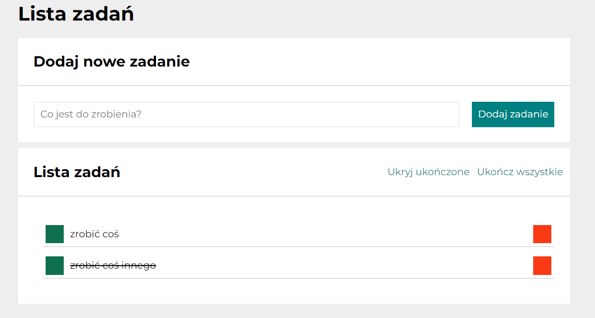
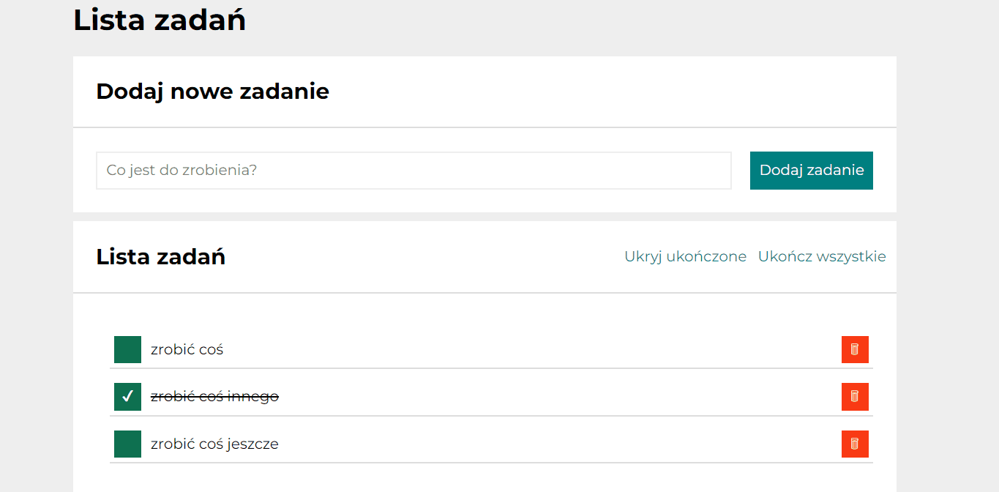

# To-do List with react

This project was bootstrapped with [Create React App](https://github.com/facebook/create-react-app).

## Description
Hi! Welcome to my todo list, where you can create your list of tasks that can help you organize your work. 😊 Below som information for users how to navigate through the website and information for developers about code itself. So, what are you waiting for? Click th link in the demo and try it out 😉

## Details for users
1. Website is available only in polish (I am about to add language selection in thee future, so it will be available in english as well)
2. After starting the website for the first time, you should see two example tasks called "zrobić coś" (do something) and "zrobić coś innego" (do something else). "Zrobić coś innego" should be crossed out as it is marked as done. Also there will be two options called "ukryj ukończone" (hide done) and ukończ wszystkie (finish all). If you modify tasks on the website, new tasks list will be displayed after refreshing or even when you will re-open the website on the same device

3. You can add new task to your to-do list by selecting the input with "Co jest do zrobienia?" (What needs to be done) text and click button with "Dodaj zadanie" (add task). Task will go to section called "lista zadań" (tasks list)

4. You can select existing tasks by
- clicking green button which changes tasks status from not done to done and from done to not done

 

- clicking red button which removes task entirely

5. You can mark all tasks as done by clicking "ukończ wszystkie" (finish all) you can mark all tasks as done

6. You also can hide all tasks that are done by clicking "Ukryj ukończone" (hide done) which hides all done tasks and chcnges text into "pokaż ukończone" (show done). If you click on the text once again all done tasks will show up again

## Details for developers

1. For naming classes for HTML mark-ups I've used BEM convention for any class I was using in CSS.
2. I used media queries to change how website will be displayed on various devices
3. Hooks used:
- useState
- useEffect
4. App saves tasks in local storage and getting initial tasks from the local storage 

## Available Scripts

In the project directory, you can run:

### `npm start`

Runs the app in the development mode.\
Open [http://localhost:3000](http://localhost:3000) to view it in your browser.

The page will reload when you make changes.\
You may also see any lint errors in the console.

### `npm run build`

Builds the app for production to the `build` folder.\
It correctly bundles React in production mode and optimizes the build for the best performance.

The build is minified and the filenames include the hashes.\
Your app is ready to be deployed!

See the section about [deployment](https://facebook.github.io/create-react-app/docs/deployment) for more information.

### `npm run eject`

**Note: this is a one-way operation. Once you `eject`, you can't go back!**

If you aren't satisfied with the build tool and configuration choices, you can `eject` at any time. This command will remove the single build dependency from your project.

Instead, it will copy all the configuration files and the transitive dependencies (webpack, Babel, ESLint, etc) right into your project so you have full control over them. All of the commands except `eject` will still work, but they will point to the copied scripts so you can tweak them. At this point you're on your own.

You don't have to ever use `eject`. The curated feature set is suitable for small and middle deployments, and you shouldn't feel obligated to use this feature. However we understand that this tool wouldn't be useful if you couldn't customize it when you are ready for it.